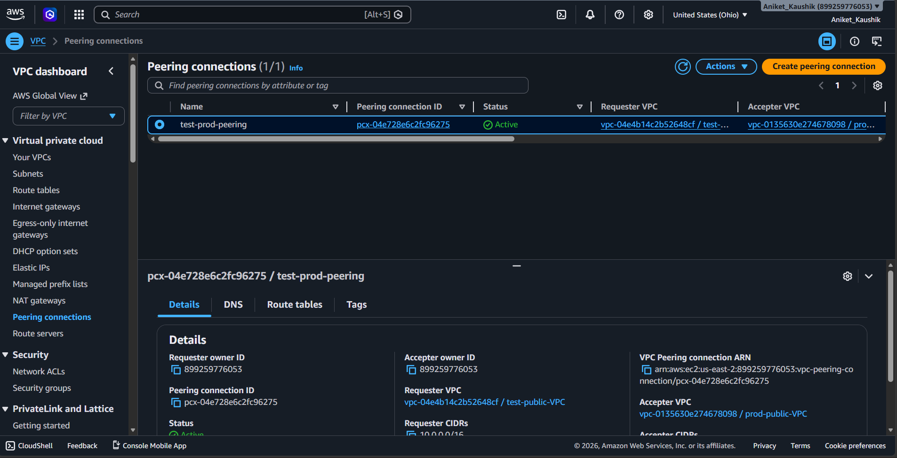
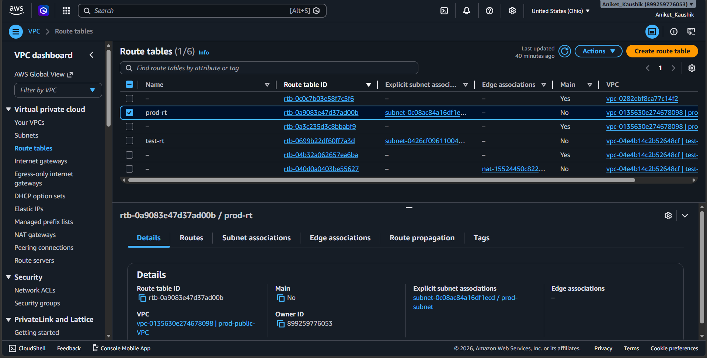
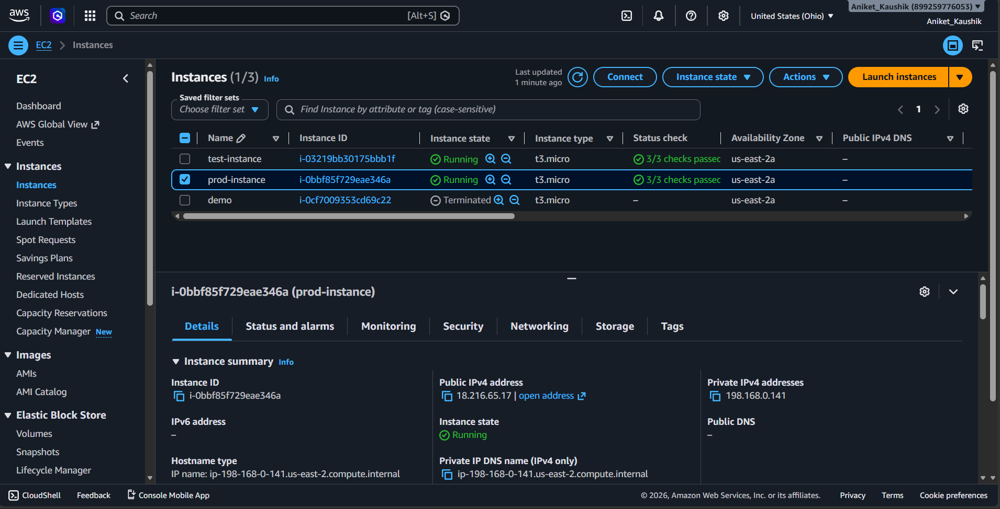
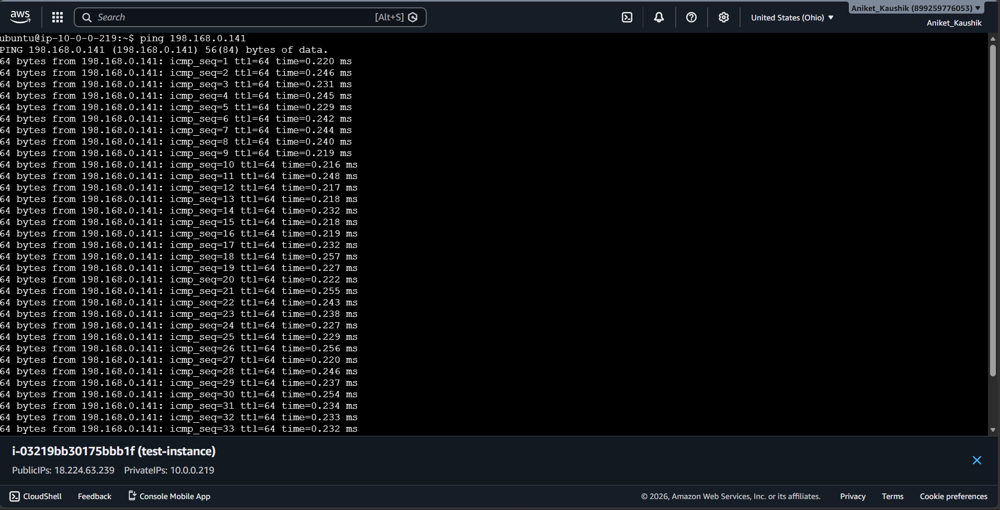

# AWS VPC Peering Networking Project

## Project Overview

This project demonstrates the implementation of core AWS networking concepts, including VPC creation, public and private subnets, Internet Gateway, NAT Gateway, Route Tables, Security Groups, and VPC Peering.

The objective was to establish secure communication between EC2 instances deployed in separate VPCs while understanding AWS network architecture and routing.

---

## Architecture

### Test VPC (10.0.0.0/16)

- Public Subnet (10.0.0.0/24)
  - EC2-Test Instance
- Private Subnet (10.0.1.0/24)
- Internet Gateway
- NAT Gateway

### Production VPC (192.168.0.0/16)

- Public Subnet (192.168.0.0/24)
  - EC2-Prod Instance

### Connectivity

- VPC Peering Connection between Test VPC and Production VPC
- Route Table configuration for inter-VPC communication
- Security Group configuration for ICMP traffic

---

## AWS Services Used

- Amazon VPC
- Amazon EC2
- Internet Gateway
- NAT Gateway
- Route Tables
- Security Groups
- VPC Peering

---

## Implementation Steps

1. Created Test and Production VPCs with non-overlapping CIDR blocks.
2. Configured public and private subnets within the Test VPC.
3. Attached an Internet Gateway to enable internet access for the public subnet.
4. Created and configured a NAT Gateway for outbound internet access from the private subnet.
5. Established a VPC Peering connection between the two VPCs.
6. Updated route tables to enable communication across VPCs.
7. Configured Security Groups to allow ICMP traffic.
8. Verified connectivity using ping between EC2 instances.

---

## Key Learning Outcomes

- Understanding AWS VPC architecture
- Public vs Private Subnet design
- Internet Gateway and NAT Gateway configuration
- Route Table management
- VPC Peering implementation
- Security Group configuration
- Inter-VPC connectivity testing

---

## Outcome

Successfully established communication between EC2 instances across two AWS VPCs using VPC Peering. Gained hands-on experience with AWS networking, routing, subnet design, and network connectivity troubleshooting.

## Screenshots

### 1. Architecture Diagram

### 2. VPC Peering Connection (Active)

### 3. Route Tables Configuration

### 4. EC2 Instances

### 5. Connectivity Test (Ping)

